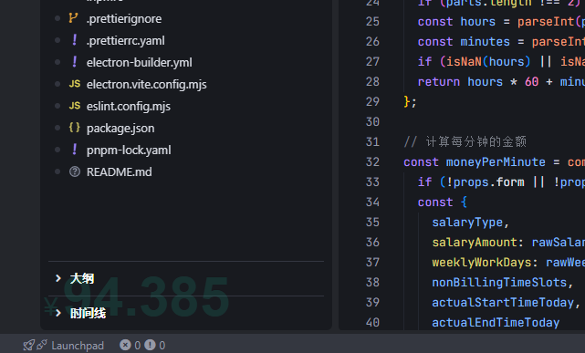
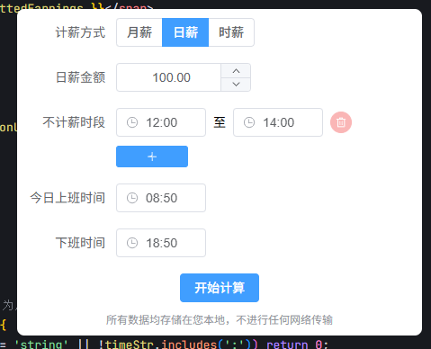

💰 Salary Calculator - 桌面摸鱼小助手

一款简洁的桌面应用，可在您电脑屏幕的左下角实时显示当日已赚取的“薪水”，让您在努力工作（或快乐摸鱼🐟）的同时，直观感受时间（金钱）的流逝。

✨ 通过灵活配置您的日薪、工作时段、休息时间以及每周工作日，本应用将自动为您计算并展示当日的“劳动成果”。

-----

## ⚠️ 免责声明

**本项目仅供娱乐和个人参考使用，计算结果可能与您的实际薪资存在一定差异。请勿将本应用的计算结果作为任何严肃财务决策的依据。**

-----

## 🚀 主要功能

* 💸 **实时薪资显示**：在桌面左下角通过一个迷你、无边框、置顶的窗口实时更新您当日已赚取的金额。
* ⚙️ **灵活配置**：
    * 自定义您的每日总薪资。
    * 设定每日的上下班打卡时间。
    * 配置一个或多个不计薪的休息时段（例如午休、下午茶时间）。
    * 自由选择每周的工作日。
* 💾 **配置持久化**：您的所有设置将自动保存在本地，下次启动应用时无需重新配置。
* 🎨 **简约设计**：采用无边框、透明背景设计，不打扰您的正常工作界面。
* 💻 **跨平台支持**：支持 Windows、macOS 和 Linux 主流桌面操作系统。 (基于 Electron 构建)
* 🛠️ **设置便捷**：托盘区轻松呼出设置界面。

-----

## 📸 预览图

* **主显示区域**：位于桌面左下角，简洁展示当前已赚金额。

  

* **设置面板**：清晰的输入项，方便您配置各项参数。

  
-----

## 🛠️ 使用方法

1.  **下载与安装**：请参考下方的 “💻 安装应用” 部分获取适合您操作系统的应用程序。
2.  **启动应用**：运行 Salary Calculator，它会自动出现在您桌面的左下角。
3.  **打开设置**：
    * 通常，您可以直接**点击**左下角显示金额的区域来打开详细的设置窗口。
4.  **配置参数**：在设置窗口中，根据您的实际情况填写或选择：
    * **日薪**：您每天的总薪资（税前或税后，根据您的计算习惯）。
    * **上班时间**：例如 `09:00`。
    * **下班时间**：例如 `18:00`。
    * **休息时段**：您可以添加一个或多个休息时段，例如从 `12:00` 到 `13:00`。在休息时段内，薪资将暂停计算。
    * **工作日**：勾选您每周需要工作的日子。
5.  **保存设置**：完成配置后，点击“保存”按钮。应用会立即根据新的配置开始计算并显示您的实时收益。

-----

## 💻 安装应用

您可以从项目的 [Releases 页面](https://github.com/perenliu1/salary-calculator/tree/main/dist) 下载最新的应用程序包：

* **Windows**：下载 `.exe` 安装包。

-----

## 🛠️ 开发与构建 (面向开发者)

如果您希望在本地修改、运行或构建此项目，请确保您的系统已安装 Node.js (推荐版本: `^18.0.0 || ^20.0.0 || >=22.0.0`) 和 `pnpm`。

1.  **克隆仓库** (请替换为您的仓库地址)：

    ```bash
    git clone https://github.com/perenliu1/salary-calculator.git
    cd salary-calculator
    ```

2.  **安装依赖**：
    项目使用 `pnpm` 作为包管理器。

    ```bash
    pnpm install
    ```

3.  **启动开发服务**：
    此命令将以开发模式启动应用，支持热重载。

    ```bash
    pnpm run dev
    ```

4.  **构建生产版本**：
    此命令将为当前平台构建可分发的应用程序。

    ```bash
    pnpm run build:win
    ```

    构建后的文件将位于项目根目录下的 `dist` 文件夹内 (根据 `electron-builder.yml` 配置)。

-----

## 🔔 重要提示

* **计算逻辑**：本应用根据您设置的日薪、总工作时长（扣除休息时间后）以及当日已工作时长，进行线性计算得出当前预估收益。
* **显示位置**：应用默认显示在屏幕左下角。若因任务栏遮挡或个人偏好希望调整位置，请自行修改源代码。
* **开源致敬**：本项目基于 Electron, Vue.js, Vite 等优秀开源技术构建。
